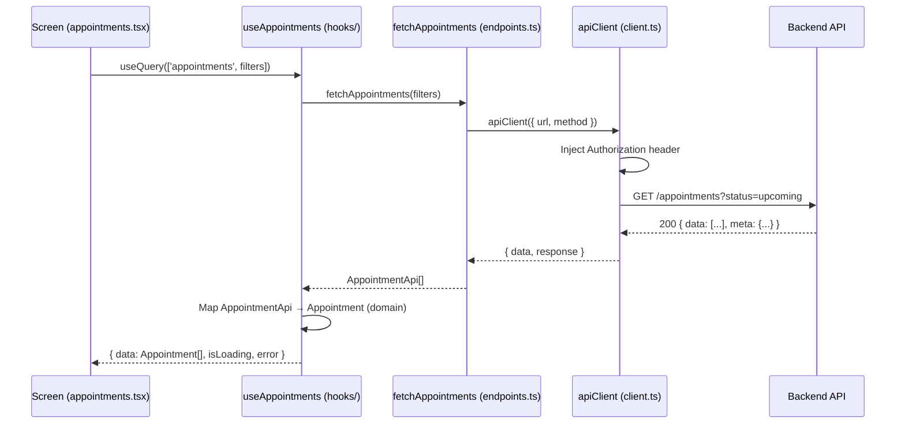
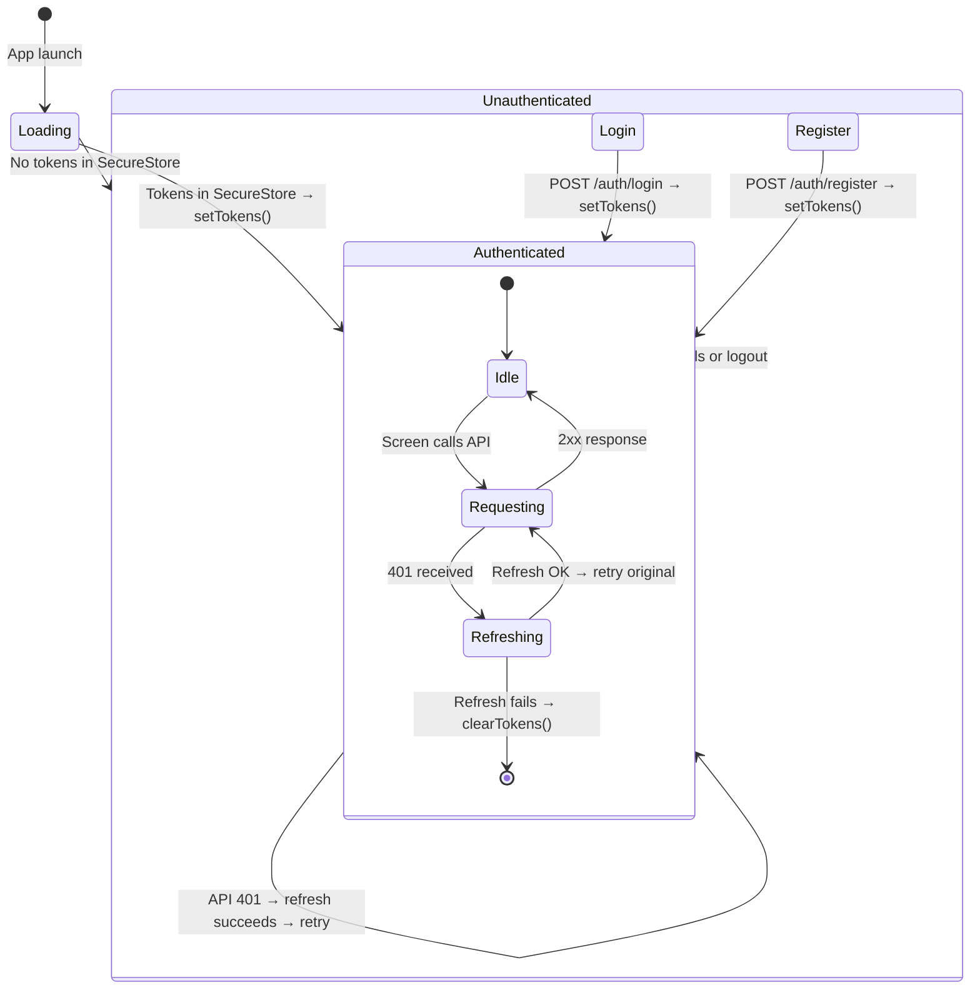

# Design: Integración API Real y Auth

Reemplaza el 100% de datos mock con llamadas reales a la API usando una arquitectura de tres capas: **client** (fetch wrapper) → **endpoints** (funciones tipadas) → **hooks** (React Query). Las pantallas existentes no importan endpoints directamente.

## Architecture Decisions

| Opción | Alternativa | Decisión | Razón |
|--------|-------------|----------|-------|
| Fetch wrapper 0-deps | Axios | **fetch nativo** | Un solo patrón 401 no justifica 30KB+ de dependencia |
| Promise dedup module-level | Axios interceptor / ref-count | **`let refreshPromise`** | Sin librería externa, atómico, sin race conditions |
| Token store en `client.ts` | Store separado / ctx como source of truth | **tokenStore in-memory + SecureStore** | Evita import circular ctx↔client; refresh escribe directo a SecureStore |
| React Query | SWR / RTK Query | **`@tanstack/react-query@5`** | Mayor ecosistema, mutation.invalidate, refetchOnFocus nativo |
| API→Domain mapping en hooks | En endpoints / en screens | **hooks layer** | Screens no cambian, endpoints son puros, hooks mapean al Appointment existente |
| `role: 'patient' \| 'doctor' \| 'admin'` | Sin role | **Definido desde ahora** | Futura expansión de routing y permisos sin romper tipos |

## Module Overview

| Archivo | Acción | Responsabilidad |
|---------|--------|----------------|
| `src/api/config.ts` | **Crear** | `BASE_URL` desde `EXPO_PUBLIC_API_URL` (default `http://localhost:3000`) |
| `src/api/client.ts` | **Crear** | Fetch wrapper, `ApiError` class, tokenStore, 401→refresh→retry con promise dedup |
| `src/api/auth/types.ts` | **Crear** | `LoginRequest`, `RegisterRequest`, `AuthResponse`, `User` |
| `src/api/auth/endpoints.ts` | **Crear** | `login()`, `register()`, `refreshToken()`, `logout()`, `forgotPassword()` |
| `src/api/appointments/types.ts` | **Crear** | `AppointmentApi`, `CreateAppointmentPayload`, `PaginatedResponse`, `ApiResponse` |
| `src/api/appointments/endpoints.ts` | **Crear** | `fetchAppointments()`, `fetchAppointment()`, `createAppointment()`, `cancelAppointment()` |
| `src/hooks/useAppointments.ts` | **Crear** | `useQuery` + `useMutation` wrappers con cache invalidation y mapeo API→Domain |
| `src/ctx.tsx` | **Modificar** | Login/register/logout llaman a endpoints reales; init lee SecureStore y sincroniza a tokenStore |
| `src/app/_layout.tsx` | **Modificar** | Envuelve con `<QueryClientProvider>` |
| `src/types/appointment.ts` | **Modificar** | Conserva solo tipos `Appointment` (domain); elimina funciones mock |
| `src/app/(app)/appointments.tsx` | **Modificar** | Usa `useAppointments()` en lugar de `getAppointments()` mock |
| `src/app/(app)/book-appointment.tsx` | **Modificar** | Usa `useCreateAppointment()` en lugar de `addAppointment()` mock |
| `.env` | **Crear** | `EXPO_PUBLIC_API_URL=http://localhost:3000` |
| `package.json` | **Modificar** | `pnpm add @tanstack/react-query` |

## Data Flow



## Token Lifecycle



### Promise Dedup (detalle técnico)

```
                    ┌─ Request A → 401 ─┐
                    │                    │
Concurrent 401s:   Request B → 401 ─────┤
                    │                    │
                    └─ Request C → 401 ─┘
                              │
                              ▼
                    refreshPromise = POST /auth/refresh
                              │
                    ┌─── success? ────┐
                    │                  │
                    ▼                  ▼
                Retry A, B, C    Clear tokens → logout
                refreshPromise = null
```

```typescript
// Estructura del token dedup (pseudocódigo conceptual)
let refreshPromise: Promise<boolean> | null = null;

if (response.status === 401) {
  if (!refreshPromise) {
    refreshPromise = doRefresh(); // única llamada POST /auth/refresh
  }
  const ok = await refreshPromise;
  if (ok) {
    refreshPromise = null;
    // retry original request con nuevo accessToken
  } else {
    // refresh falló → logout forzado
  }
}
```

## Error Handling Strategy

| Tipo | Origen | Cómo se propaga | Cómo lo ve el usuario |
|------|--------|-----------------|----------------------|
| **Network** | `fetch()` throws (sin conexión) | `ApiError{ error: 'NETWORK_ERROR', statusCode: 0 }` | Toast "Sin conexión a internet" |
| **API 4xx** | Backend responde con error body | `ApiError{ error, message, statusCode, validationErrors }` | Mensaje inline en formulario |
| **API 5xx** | Backend error interno | `ApiError{ error: 'SERVER_ERROR', statusCode: 5xx }` | Toast "Error del servidor, intentá más tarde" |
| **401 → refresh fail** | Refresh token expirado | `ApiError{ error: 'SESSION_EXPIRED' }` → redirige a login | Pantalla de login con mensaje "Sesión expirada" |
| **Validation** | `validationErrors` en 422 | Hook expone `fieldErrors` | Error inline por campo |

### ApiError class

```typescript
export class ApiError extends Error {
  constructor(readonly error: string, readonly statusCode: number, readonly validationErrors?: Record<string, string[]>) {
    super(message);
  }
}
```

Las pantallas existentes con manejo de error vía `try/catch` en login/register siguen igual; React Query expone `isError` y `error` para appointments.

## Component Tree (integración con hooks)

```mermaid
graph TD
    QP[QueryClientProvider] --> AL[RootLayoutNav]
    AL --> AS[AuthProvider]
    AS --> LS[LoginScreen]
    AS --> RS[RegisterScreen]
    AS --> AP[AppointmentsScreen]
    AS --> BK[BookAppointmentScreen]
    AS --> DT[AppointmentDetail]

    LS --> useAuth[useAuth: login()]
    RS --> useAuth
    AP --> useAppts[useAppointments filters]
    BK --> useCreate[useCreateAppointment]
    DT --> useDetail[useAppointment id]

    useAppts --> EA[endpoints: fetchAppointments]
    useCreate --> EC[endpoints: createAppointment]
    useDetail --> ED[endpoints: fetchAppointment]
    useAuth --> EL[endpoints: login]

    EA --> CL[apiClient]
    EC --> CL
    EL --> CL
```

## Cambios específicos en pantallas existentes

### `appointments.tsx`

| Actual (mock) | Nuevo (API) |
|---------------|-------------|
| `const appointments = useMemo(() => filterAppointments(activeFilter), [activeFilter])` | `const { data: appointments, isLoading } = useAppointments(activeFilter)` |
| `isEmpty` basado en length del array | `isEmpty` basado en `data?.length === 0` (con loading state) |
| Sin loading state | `isLoading && <ActivityIndicator />` |

### `book-appointment.tsx`

| Actual (mock) | Nuevo (API) |
|---------------|-------------|
| `addAppointment({...})` síncrono | `const { mutateAsync } = useCreateAppointment()` |
| `setConfirmedId(newId)` inmediato | `await mutateAsync(payload)` → router.push |
| Sin manejo de error | `try/catch` con `error.message` mostrado inline |

## Migration Path

```
Fase 1 (este cambio):  Crear src/api/* + src/hooks/* → screens usan hooks → se borran mocks
Fase 2 (futuro):       Agregar soporte doctor/admin → routing por role
Fase 3 (futuro):       Agregar virtual care (videollamada)
```

No hay feature flag — el reemplazo es atómico: se crean las capas nuevas, se modifican las pantallas, se eliminan las funciones mock. Rollback: revertir commit.

## Testing Strategy

| Capa | Qué probar | Enfoque |
|------|-----------|---------|
| **client.ts** | ApiError lanzado en no-2xx; 401→refresh→retry; Authorization header | Jest con `jest.spyOn(global, 'fetch')` |
| **endpoints** | Request body y URL correctos; tipos de response | Unit con fetch mockeado |
| **useAppointments** | Query keys, cache invalidation, loading/error states | `@testing-library/react-hooks` con QueryClientProvider wrapper |
| **ctx.tsx** | init desde SecureStore, login llama endpoint, logout limpia | Integration con SecureStore mockeado |
| **Screens** | Las pantallas renderizan datos desde hooks | `@testing-library/react-native` con mocks de hooks |

## Dependencias nuevas

```
pnpm add @tanstack/react-query
```

## Open Questions

- [ ] ¿Cuál es el timeout por defecto del backend? Impacta `staleTime` y `retry`.
- [ ] ¿`POST /auth/logout` requiere autenticación (accessToken en header)? Asumimos que sí por ahora.
- [ ] ¿El endpoint `POST /auth/refresh` espera `refreshToken` en body o en header? Asumimos body por simplicidad.
